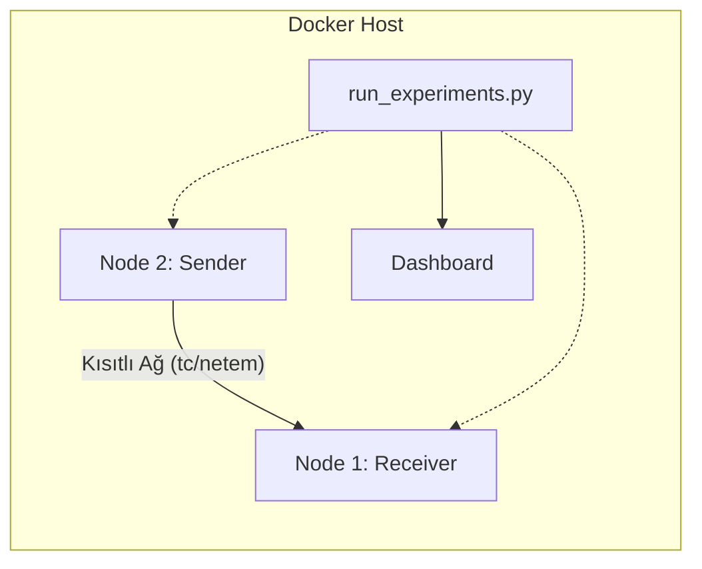

# LPWAN Protokol Benchmark Dokümantasyonu

Bu proje, kısıtlı ağ koşulları (Düşük Bant Genişliği, Yüksek Gecikme, Paket Kaybı) altında çeşitli IoT haberleşme protokollerinin performansını ölçmek ve karşılaştırmak için tasarlanmış bir test çerçevesidir.

## 1. Mimari Genel Bakış

Sistem, **Docker** konteynırları üzerinde çalışan izole edilmiş düğümlerden oluşur. Bu yaklaşım, gerçek bir ağ topolojisini simüle etmemize ve Linux çekirdeğinin ağ özelliklerini kullanarak bağlantı kalitesini manipüle etmemize olanak tanır.

### Topoloji
*   **Node 1 (Receiver):** Verileri alan sunucu/broker tarafı.
*   **Node 2 (Sender):** Verileri üreten ve gönderen sensör/istemci tarafı.
*   **Network (lpwan_net):** İki düğüm arasındaki sanal ağ köprüsü.

## 2. Nasıl Çalışır? (İş Akışı)

Test süreci `run_experiments.py` tarafından yönetilir ve aşağıdaki adımları izler:

1.  **Ortam Hazırlığı:** Docker konteynırları (`node1` ve `node2`) başlatılır.
2.  **Paralel Yürütme:** Her protokol (MQTT, CoAP, HTTP vb.) için ayrı bir iş parçacığı (thread) başlatılır.
3.  **Döngüsel Testler:** Her protokol, aşağıdaki parametre kombinasyonları için test edilir:
    *   **Payload Size:** 16 byte, 128 byte
    *   **Rate:** 1, 10, 100 msg/sec
    *   **Bandwidth:** 50kbit, 100kbit, 250kbit, 1mbit
    *   **Loss:** %0, %1, %5, %10
    *   **Delay:** 0ms, 20ms, 100ms, 500ms
4.  **Ağ Manipülasyonu:** Test başlamadan önce `setup_network.sh` scripti ile Linux `tc` (Traffic Control) aracı kullanılarak ağ koşulları bozulur.
5.  **Trafik Üretimi:**
    *   **Sender:** Belirlenen hızda ve sürede paketler üretir. Her paketin içine gönderim zamanı (`t`) ve sıra numarası (`s`) gömülür.
    *   **Receiver:** Gelen paketleri dinler, varış zamanını kaydeder ve sıra numarasını kontrol eder.
6.  **Veri Toplama:** Test bitiminde receiver'dan ham veriler çekilir ve analiz edilir.

## 3. Neyi, Nasıl Ölçüyoruz?

Ölçümler `traffic_agent.py` içerisindeki `MetricsCollector` sınıfı tarafından yapılır.

### 3.1. Delivery Ratio (İletim Oranı)
*   **Tanım:** Gönderilen paketlerin ne kadarının başarıyla ulaştığını gösterir.
*   **Nasıl Ölçülür:** `(Alınan Benzersiz Paket Sayısı / Gönderilmesi Gereken Paket Sayısı) * 100`
*   **Önemli Detay:** CoAP gibi protokollerde "retry" mekanizması nedeniyle aynı paket birden fazla kez gelebilir. Sistem `seen_sequences` (görülen sıra numaraları) seti kullanarak mükerrer paketleri eler ve %100 üzeri hatalı sonuçları engeller.

### 3.2. Latency (Gecikme)
*   **Tanım:** Bir paketin gönderildiği andan alıcıya ulaştığı ana kadar geçen süre (End-to-End Delay).
*   **Nasıl Ölçülür:** `Varış Zamanı (Receiver) - Gönderim Zamanı (Payload içindeki 't')`
*   **Not:** Docker konteynırları aynı host makinede çalıştığı için saat senkronizasyonu sorunu yoktur.

### 3.3. Jitter (Gecikme Değişimi)
*   **Tanım:** Gecikme sürelerindeki kararsızlık veya değişkenlik.
*   **Nasıl Ölçülür:** Ölçülen tüm latency değerlerinin standart sapması (`numpy.std`).

### 3.4. Throughput (Veri Akış Hızı)
*   **Tanım:** Saniye başına başarıyla iletilen veri miktarı.
*   **Nasıl Ölçülür:** `(Alınan Paket Sayısı * Paket Boyutu * 8) / Test Süresi` (bps cinsinden).

## 4. Ağ Simülasyonu (Neden Yapılıyor?)

LPWAN (Low Power Wide Area Network) teknolojileri (LoRaWAN, NB-IoT vb.) fiziksel doğaları gereği kısıtlıdır. Localhost üzerinde yapılan testler bu protokollerin gerçek performansını yansıtmaz.

Bu projede **Linux Traffic Control (`tc`)** ve **Network Emulator (`netem`)** kullanılarak şu koşullar yapay olarak oluşturulur:

*   **Bandwidth Limit (TBF):** Veri hattını daraltır (örn. 50kbit). Bu, LoRaWAN gibi düşük hızlı hatları simüle eder.
*   **Delay (Gecikme):** Paketlerin iletimine yapay gecikme ekler. Uzak mesafeli haberleşmeyi simüle eder.
*   **Packet Loss (Paket Kaybı):** Paketleri rastgele düşürür. Radyo paraziti veya sinyal zayıflığını simüle eder.

## 5. Desteklenen Protokoller ve İmplementasyon Detayları

| Protokol | Kütüphane | Tip | Notlar |
|----------|-----------|-----|--------|
| **MQTT** | `paho-mqtt` | TCP | Kalıcı bağlantı, QoS 0/1 desteği. |
| **MQTT-SN**| `scapy` (Custom)| UDP | MQTT'nin UDP versiyonu. Custom implementasyon. |
| **CoAP** | `aiocoap` | UDP | CON (Confirmable) ve NON (Non-confirmable) modları. |
| **HTTP** | `requests/flask`| TCP | RESTful POST istekleri. Yüksek overhead. |
| **AMQP** | `pika` | TCP | RabbitMQ üzerinden kuyruk tabanlı iletim. |
| **XMPP** | `slixmpp` | TCP | XML tabanlı mesajlaşma. |
| **Zenoh** | `eclipse-zenoh`| TCP/UDP| Yeni nesil, yüksek performanslı edge protokolü. |

## 6. Proje Yapısı

*   `run_experiments.py`: Testleri yöneten ana orkestratör. Paralel iş parçacıklarını ve dosya yönetimini sağlar.
*   `traffic_agent.py`: Hem Sender hem Receiver olarak çalışan, protokollerin implementasyonunu barındıran script.
*   `setup_network.sh`: Ağ kısıtlamalarını uygulayan shell script.
*   `dashboard.py`: Flask tabanlı web arayüzü.
*   `results/`: Test sonuçlarının (CSV) ve logların kaydedildiği dizin.

## 7. Tasarım Kararları ve İpuçları

1.  **Neden Paralel Çalışma?**
    Test kombinasyonlarının sayısı çok fazladır (3000+ test). Seri çalışma günlerce sürebilir. Protokol seviyesinde paralelleştirme ile süre 8 kat kısaltılmıştır.

2.  **İzolasyon Nasıl Sağlandı?**
    Paralel çalışırken protokollerin birbirini etkilememesi için:
    *   Her protokol farklı portlar kullanır.
    *   `pkill` komutları sadece ilgili protokolün process'ini hedefler (`--proto` filtresi).
    *   CoAP NON ve CON modları için çakışmayı önlemek adına farklı portlar (5683, 5684) atanmıştır.

3.  **Veri Bütünlüğü**
    Sonuçlar CSV dosyalarına anlık olarak yazılır. Dashboard bu dosyaları okuyarak canlı grafikler oluşturur.
