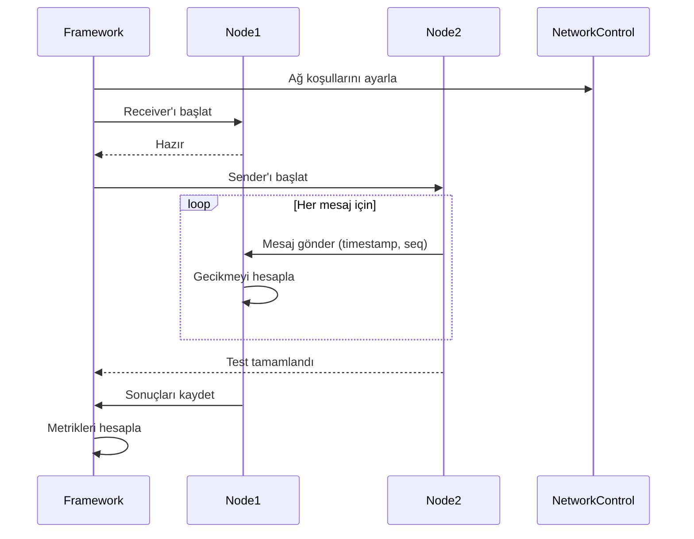

# LPWAN Protocol Benchmark Framework

Düşük Güç Geniş Alan Ağ (LPWAN) protokollerinin performansını karşılaştırmalı olarak ölçümleyen bir test ve analiz platformu.

## 📋 İçindekiler

- [Genel Bakış](#genel-bakış)
- [Test Edilen Protokoller](#test-edilen-protokoller)
- [Nasıl Çalışır](#nasıl-çalışır)
- [Ölçülen Metrikler](#ölçülen-metrikler)
- [Ağ Koşulları](#ağ-koşulları)
- [Kurulum ve Kullanım](#kurulum-ve-kullanım)
- [Dashboard](#dashboard)
- [Sonuçlar](#sonuçlar)
- [Mimari](#mimari)

---

## 🎯 Genel Bakış

Bu framework, IoT ve LPWAN uygulamalarında kullanılan farklı mesajlaşma protokollerinin performansını **aynı ağ koşullarında** test ederek objektif karşılaştırmalar yapar.

### Temel Özellikler

- ✅ **8 farklı protokol** desteği
- ✅ **Paralel test** yürütme (tüm protokoller aynı anda test edilir)
- ✅ **Gerçekçi ağ koşulları** simülasyonu (bant genişliği, paket kaybı, gecikme)
- ✅ **Canlı dashboard** ile sonuç takibi
- ✅ **Detaylı metrik** analizi (delivery ratio, latency, jitter, throughput)
- ✅ **Docker containerization** ile izole test ortamı

---

## 🔌 Test Edilen Protokoller

| Protokol | Port | Açıklama | Kullanım Alanı |
|----------|------|----------|----------------|
| **MQTT** | 1883 | TCP tabanlı pub/sub mesajlaşma | IoT, telemetri |
| **CoAP-CON** | 5683 | UDP tabanlı, güvenilir (Confirmable) | Kısıtlı cihazlar |
| **CoAP-NON** | 5684 | UDP tabanlı, güvenilir olmayan (Non-confirmable) | Sensör verileri |
| **MQTT-SN** | 1884 | UDP tabanlı MQTT varyantı | Kısıtlı ağlar |
| **Zenoh** | - | Pub/sub/query sistemi | Edge computing |
| **HTTP** | 8000 | REST API benzeri | Web servisleri |
| **AMQP** | 5672 | RabbitMQ mesajlaşma | Enterprise mesajlaşma |
| **XMPP** | 5222 | XML tabanlı mesajlaşma | Anlık mesajlaşma |

---

## ⚙️ Nasıl Çalışır

### 1. Test Ortamı Hazırlığı

Framework, Docker Compose kullanarak **2 node'luk** bir test ağı oluşturur:

```
┌─────────────┐         ┌─────────────┐
│   Node 1    │ ◄─────► │   Node 2    │
│  (Receiver) │  Test   │  (Sender)   │
└─────────────┘  Ağı    └─────────────┘
```

- **Node 1 (Receiver)**: Her protokol için bir receiver process çalıştırır
- **Node 2 (Sender)**: Test mesajları gönderir
- **Network Bridge**: tc (traffic control) ile ağ koşulları simüle edilir

### 2. Test Parametreleri

Her test kombinasyonu şu parametrelerle çalışır:

| Parametre | Değerler | Açıklama |
|-----------|----------|----------|
| **Payload Size** | 16, 128 bytes | Mesaj boyutu |
| **Message Rate** | 1, 10, 100 msg/s | Saniyedeki mesaj sayısı |
| **Bandwidth** | 50k, 100k, 250k, 1M bit/s | Bant genişliği limiti |
| **Packet Loss** | 0%, 1%, 5%, 10% | Paket kaybı oranı |
| **Network Delay** | 0, 20, 100, 500 ms | Ağ gecikmesi |

**Toplam Test Sayısı**: 8 protokol × 2 boyut × 3 rate × 4 bant genişliği × 4 kayıp × 4 gecikme = **3,072 test**

### 3. Test Akışı



### 4. Mesaj Formatı

Her mesaj şu bilgileri içerir:

```json
{
  "s": 42,              // Sequence number (sıra numarası)
  "t": 1701234567.123   // Timestamp (gönderim zamanı)
}
```

Mesaj boyutu padding ile doldurulur.

---

## 📊 Ölçülen Metrikler

### 1. Delivery Ratio (Teslimat Oranı)

**Formül**: `(Alınan Mesaj Sayısı / Gönderilen Mesaj Sayısı) × 100`

**Açıklama**: Gönderilen mesajların yüzde kaçının hedefe ulaştığını gösterir.

```python
DeliveryRatio = (Received / Sent) × 100
```

**Değerlendirme**:
- ✅ **95-100%**: Mükemmel
- ⚠️ **80-95%**: Orta
- ❌ **<80%**: Zayıf

### 2. Latency (Gecikme)

**Formül**: `Alınma Zamanı - Gönderilme Zamanı`

**Açıklama**: Bir mesajın kaynaktan hedefe ulaşma süresi.

```python
Latency = receive_time - send_time
LatencyAvg = mean(all_latencies)
```

**Ölçümler**:
- `LatencyAvg_ms`: Ortalama gecikme (milisaniye)
- `LatencyMin_ms`: Minimum gecikme
- `LatencyMax_ms`: Maksimum gecikme
- `LatencyP95_ms`: %95'lik dilim (95. yüzdelik)

### 3. Jitter (Gecikme Değişkenliği)

**Formül**: Ardışık mesajlar arası gecikme farkının standart sapması

**Açıklama**: Gecikmenin ne kadar tutarsız olduğunu gösterir.

```python
Jitter = std_dev(latency[i] - latency[i-1])
```

**Önem**: Düşük jitter = Daha öngörülebilir performans

### 4. Throughput (Veri İletim Hızı)

**Formül**: `(Alınan Mesaj Sayısı × Mesaj Boyutu × 8) / Test Süresi`

**Açıklama**: Saniyede kaç bit veri aktarıldığı.

```python
Throughput_bps = (Received × PayloadSize × 8) / Duration
```

**Birim**: bits per second (bps)

---

## 🌐 Ağ Koşulları

Framework, Linux `tc` (traffic control) aracını kullanarak gerçekçi ağ koşulları simüle eder:

### Bandwidth Limiting (Bant Genişliği Sınırlandırma)

```bash
tc qdisc add dev eth0 root tbf rate 50kbit burst 32kbit latency 400ms
```

**Parametreler**:
- `rate`: Maksimum hız (50kbit, 100kbit, 250kbit, 1mbit)
- `burst`: Token bucket boyutu
- `latency`: Maksimum paket gecikmesi

### Packet Loss (Paket Kaybı)

```bash
tc qdisc add dev eth0 root netem loss 5%
```

**Simülasyon**: Rastgele paket kayıpları (0%, 1%, 5%, 10%)

### Network Delay (Ağ Gecikmesi)

```bash
tc qdisc add dev eth0 root netem delay 100ms
```

**Simülasyon**: Sabit gecikme ekleme (0ms, 20ms, 100ms, 500ms)

### Kombine Koşullar

```bash
tc qdisc add dev eth0 root handle 1: tbf rate 50kbit burst 32kbit latency 400ms
tc qdisc add dev eth0 parent 1:1 handle 10: netem delay 100ms loss 5%
```

---

## 🚀 Kurulum ve Kullanım

### Gereksinimler

- Docker & Docker Compose
- Python 3.11+
- 8GB+ RAM (paralel testler için)

### Kurulum

```bash
# Repository'yi klonla
git clone <repo-url>
cd LPWAN

# Virtual environment oluştur
python3 -m venv venv
source venv/bin/activate  # Linux/Mac
# veya
venv\Scripts\activate     # Windows

# Bağımlılıkları yükle
pip install -r requirements.txt

# Docker container'ları build et
docker-compose build
```

### Testleri Çalıştırma

#### 1. Manuel Test (Tek Protokol)

```bash
# Container'ları başlat
docker-compose up -d

# Receiver'ı başlat (Node 1'de)
docker exec -d node1 python /app/traffic_agent.py \
    --mode receiver --proto mqtt

# Sender'ı çalıştır (Node 2'de)
docker exec node2 python /app/traffic_agent.py \
    --mode sender --proto mqtt \
    --size 128 --rate 10 --duration 10

# Sonuçları al
docker exec node1 cat /app/results.json
```

#### 2. Otomatik Test Suite (Tüm Protokoller)

```bash
# Tüm testleri paralel çalıştır
source venv/bin/activate
python run_experiments.py
```

**İlerleme**: `tail -f experiment_log.txt`

#### 3. Dashboard ile İzleme

```bash
# Dashboard'u başlat
source venv/bin/activate
python dashboard.py

# Tarayıcıda aç
# http://localhost:5001
```

---

## 📱 Dashboard

Web tabanlı canlı izleme ve analiz platformu.

### Özellikler

#### 1. Genel Bakış
- Protokol karşılaştırma grafikleri (Delivery Ratio, Latency, Throughput)
- Gerçek zamanlı ilerleme takibi
- Protokol bazlı detaylı kartlar

#### 2. Detaylı İstatistikler
- Min/Max/Median/P95/Std Dev değerleri
- Her metrik için kapsamlı analiz
- Renkli badge'ler (iyi/orta/kötü)

#### 3. Ağ Koşulları Analizi
- Bandwidth bazlı karşılaştırma
- Paket kaybı bazlı performans
- Gecikme bazlı latency analizi

#### 4. Filtreleme ve Arama
- Protokol, bandwidth, loss, delay, payload filtreleri
- Dinamik tablo güncelleme
- Özel sorgu desteği

#### 5. Export
- CSV formatında sonuç indirme
- JSON formatında veri export

### API Endpoints

| Endpoint | Açıklama |
|----------|----------|
| `GET /api/status` | Test ilerleme durumu |
| `GET /api/comparison` | Protokol karşılaştırma verileri |
| `GET /api/detailed-stats` | Detaylı istatistikler |
| `GET /api/network-conditions` | Ağ koşulları analizi |
| `GET /api/filtered-data?protocol=mqtt&bandwidth=50kbit` | Filtrelenmiş veri |
| `GET /api/export/csv` | CSV export |
| `GET /api/export/json` | JSON export |
| `POST /api/control/start` | Testleri başlat |
| `POST /api/control/stop` | Testleri durdur |

---

## 📂 Sonuçlar

### Dosya Yapısı

```
results/
├── results_mqtt.csv          # MQTT test sonuçları
├── results_coap_con.csv      # CoAP-CON sonuçları
├── results_coap_non.csv      # CoAP-NON sonuçları
├── results_mqtt_sn.csv       # MQTT-SN sonuçları
├── results_zenoh.csv         # Zenoh sonuçları
├── results_http.csv          # HTTP sonuçları
├── results_amqp.csv          # AMQP sonuçları
└── results_xmpp.csv          # XMPP sonuçları
```

### CSV Formatı

```csv
Protocol,Size,Rate,Bandwidth,Loss,Delay_ms,Sent,Received,DeliveryRatio,LatencyAvg_ms,Jitter_ms,Throughput_bps
mqtt,16,1,50kbit,0%,0,10,10,100.0,23.36,7.79,128.0
mqtt,16,1,50kbit,0%,20,10,10,100.0,46.44,23.92,128.0
```

### Örnek Analiz

```python
import pandas as pd

# MQTT sonuçlarını yükle
df = pd.read_csv('results/results_mqtt.csv')

# 50kbit bandwidth'te ortalama delivery ratio
avg_delivery = df[df['Bandwidth'] == '50kbit']['DeliveryRatio'].mean()
print(f"Ortalama Delivery: {avg_delivery}%")

# Paket kaybı etkisi
loss_impact = df.groupby('Loss')['DeliveryRatio'].mean()
print(loss_impact)
```

---

## 🏗️ Mimari

### Sistem Bileşenleri

```
┌─────────────────────────────────────────────────────────────┐
│                      Host Machine                           │
│  ┌──────────────────────────────────────────────────────┐   │
│  │              run_experiments.py                      │   │
│  │  • Paralel test orkestrayonu                         │   │
│  │  • 8 thread (her protokol için 1)                    │   │
│  │  • Ağ koşulları yönetimi                             │   │
│  └──────────────────────────────────────────────────────┘   │
│                           ↓                                  │
│  ┌──────────────────┐         ┌──────────────────┐          │
│  │   Node 1 (RX)    │←───────→│   Node 2 (TX)    │          │
│  │  Docker Container│  Bridge  │  Docker Container│          │
│  │                  │  Network │                  │          │
│  │ • 8 Receivers    │   +tc    │ • Senders        │          │
│  │ • results.json   │          │ • Test runner    │          │
│  └──────────────────┘          └──────────────────┘          │
│                           ↓                                  │
│  ┌──────────────────────────────────────────────────────┐   │
│  │                  dashboard.py                        │   │
│  │  • Flask web server (port 5001)                      │   │
│  │  • Real-time monitoring                              │   │
│  │  • Data visualization                                │   │
│  └──────────────────────────────────────────────────────┘   │
└─────────────────────────────────────────────────────────────┘
```

### Kod Yapısı

```
LPWAN/
├── traffic_agent.py          # Test agent (sender/receiver)
│   ├── MetricsCollector      # Metrik toplama
│   ├── MQTTTester            # MQTT implementasyonu
│   ├── CoAPTester            # CoAP implementasyonu
│   ├── MQTTSNTester          # MQTT-SN implementasyonu
│   ├── ZenohTester           # Zenoh implementasyonu
│   ├── HTTPTester            # HTTP implementasyonu
│   ├── AMQPTester            # AMQP implementasyonu
│   └── XMPPTester            # XMPP implementasyonu
│
├── run_experiments.py        # Test orkestratörü
│   ├── setup_environment()   # Container ve ağ hazırlığı
│   ├── apply_network_conditions()  # tc ile ağ simülasyonu
│   ├── run_single_test()     # Tek test çalıştırma
│   └── run_protocol_tests()  # Protokol test thread'i
│
├── dashboard.py              # Web dashboard
│   ├── get_experiment_status()      # İlerleme takibi
│   ├── get_detailed_stats()         # İstatistik hesaplama
│   ├── get_network_condition_comparison()  # Ağ analizi
│   └── get_filtered_data()          # Veri filtreleme
│
├── setup_network.sh          # Ağ konfigürasyonu
├── docker-compose.yml        # Container tanımları
├── Dockerfile                # Container image
└── requirements.txt          # Python bağımlılıkları
```

### Thread Modeli

```python
# run_experiments.py içinde
threads = []
for protocol in PROTOCOLS:
    thread = threading.Thread(
        target=run_protocol_tests,
        args=(protocol,)
    )
    threads.append(thread)
    thread.start()

# Her protokol kendi thread'inde çalışır
# Paralel testler = Daha hızlı tamamlanma
```

---

## 🔍 Önemli Teknik Detaylar

### 1. CoAP-NON Port Ayrımı

CoAP-CON ve CoAP-NON aynı anda çalışabilmesi için farklı portlar kullanır:

```python
# traffic_agent.py
class CoAPTester:
    def __init__(self, host, mtype="CON"):
        self.port = 5684 if mtype == "NON" else 5683
```

**Neden?** Aynı portu kullansalardı, receiver'lar充突 ederdi.

### 2. Duplicate Detection

```python
class MetricsCollector:
    def __init__(self):
        self.seen_sequences = set()

    def record(self, timestamp, seq):
        if seq in self.seen_sequences:
            return  # Duplicate, kaydetme
        self.seen_sequences.add(seq)
```

**Neden?** Bazı protokoller (özellikle UDP tabanlı) mesajları tekrarlayabilir.

### 3. Ağ Koşulları Reset

Her testten önce ağ koşulları sıfırlanır:

```bash
tc qdisc del dev eth0 root 2>/dev/null || true
```

**Neden?** Önceki testin ayarları bir sonraki testi etkilemesin.

### 4. Timeout Yönetimi

```python
# 30 saniye içinde test tamamlanmazsa timeout
timeout = 30
signal.alarm(timeout)
```

**Neden?** Takılan testlerin sistemi bloke etmesini önler.

---

## 📈 Beklenen Sonuçlar

### Protokol Karşılaştırması

| Protokol | Delivery Ratio | Latency | Güçlü Yanlar |
|----------|----------------|---------|--------------|
| **MQTT** | Yüksek (95%+) | Orta | Güvenilir, geniş destek |
| **CoAP-CON** | Yüksek (90%+) | Orta | Hafif, güvenilir |
| **CoAP-NON** | Orta (70-90%) | Düşük | Hızlı, düşük overhead |
| **MQTT-SN** | Orta-Yüksek | Orta | Kısıtlı ağlar için optimize |
| **Zenoh** | Yüksek | Düşük | Modern, performanslı |
| **HTTP** | Yüksek | Yüksek | Yaygın, kolay debug |
| **AMQP** | Çok Yüksek | Yüksek | Enterprise, güvenilir |
| **XMPP** | Yüksek | Yüksek | Anlık mesajlaşma |

### Ağ Koşulları Etkisi

**Düşük Bant Genişliği (50kbit)**:
- UDP protokolleri (CoAP-NON, MQTT-SN) daha iyi performans
- TCP overhead'i belirginleşir

**Yüksek Paket Kaybı (%10)**:
- TCP tabanlı protokoller (MQTT, HTTP, AMQP) daha iyi
- Otomatik yeniden gönderim mekanizmaları devreye girer

**Yüksek Gecikme (500ms)**:
- Tüm protokollerde latency artar
- CoAP-NON en az etkilenir (acknowledgement yok)

---

## 🐛 Sorun Giderme

### Container Başlamıyor

```bash
# Logları kontrol et
docker-compose logs node1
docker-compose logs node2

# Container'ları yeniden başlat
docker-compose down
docker-compose up -d
```

### Port Çakışması

```bash
# Kullanımdaki portları kontrol et
lsof -i :5001  # Dashboard
lsof -i :1883  # MQTT
lsof -i :5683  # CoAP

# Process'i sonlandır
kill -9 <PID>
```

### Testler Takılıyor

```bash
# Çalışan test process'lerini kontrol et
ps aux | grep run_experiments

# Timeout olan testleri kontrol et
tail -f experiment_log.txt | grep -i timeout
```

### Ağ Koşulları Uygulanmıyor

```bash
# tc kurallarını kontrol et
docker exec node1 tc qdisc show dev eth0

# Manuel olarak uygula
docker exec node1 tc qdisc add dev eth0 root netem delay 100ms loss 5%
```

---

## 📚 Referanslar

- [MQTT Protocol](https://mqtt.org/)
- [CoAP RFC 7252](https://datatracker.ietf.org/doc/html/rfc7252)
- [MQTT-SN Specification](https://www.oasis-open.org/committees/mqtt-sn/)
- [Eclipse Zenoh](https://zenoh.io/)
- [AMQP Protocol](https://www.amqp.org/)
- [XMPP Standards](https://xmpp.org/)
- [Linux Traffic Control](https://man7.org/linux/man-pages/man8/tc.8.html)

---

## 📄 Lisans

MIT License - Detaylar için LICENSE dosyasına bakın.

## 👥 Katkıda Bulunma

1. Fork yapın
2. Feature branch oluşturun (`git checkout -b feature/amazing`)
3. Commit yapın (`git commit -m 'Add amazing feature'`)
4. Push yapın (`git push origin feature/amazing`)
5. Pull Request açın

---

**Not**: Bu framework akademik araştırma ve protokol karşılaştırması için tasarlanmıştır. Production ortamlarında kullanmadan önce ek güvenlik ve optimizasyon gerekebilir.
